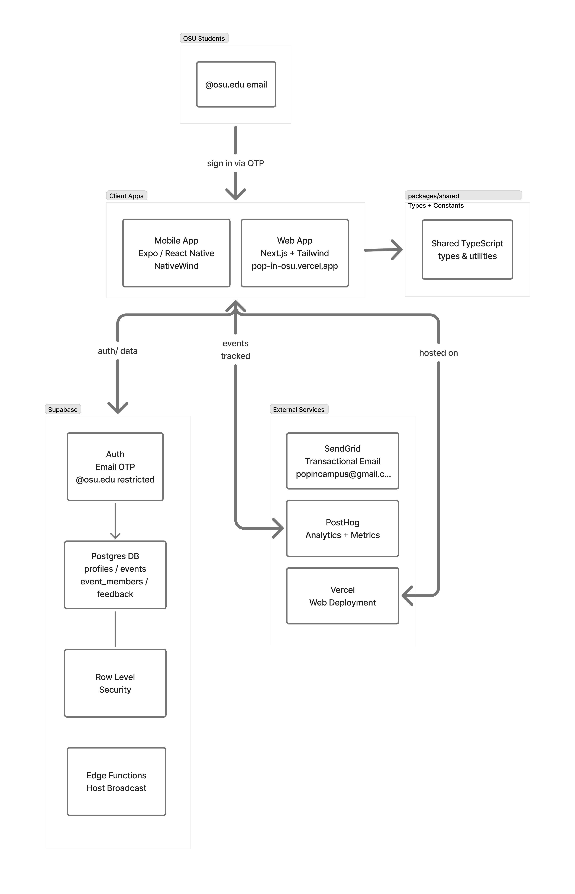

# PopIn — OSU Student Events Platform

An event discovery and management platform for OSU students, built as a pnpm monorepo with both mobile and web apps.

## Tech Stack

- **Apps**: Expo (React Native + Web) + TypeScript + Expo Router
- **Styling**: NativeWind (Tailwind CSS)
- **Backend**: Supabase (Auth, Postgres, RLS, Edge Functions, Storage)
- **Package Manager**: pnpm workspaces

## Monorepo Structure

- `apps/mobile`: Mobile client (Expo)
- `apps/web`: Web client (Expo Web)
- `packages/shared`: Shared TypeScript types
- `supabase`: SQL migrations and edge functions
- Root `package.json`: workspace-level scripts (`mobile`, `web`, etc.)

## Architecture


## Features

- **Auth**: Email OTP, restricted to @osu.edu
- **Feed**: Browse active events with time filters
- **Events**: Create, edit, cancel (host); join/leave (attendee)
- **Profiles**: Avatar, stats, interest tags; view other users' profiles
- **Push Notifications**: Join alerts to host, update/cancel alerts to attendees, 15-min start reminders
- **Event Photos**: Host can upload a cover image

Both `mobile` and `web` use the same Supabase backend and core app flows.

## Getting Started

### 1. Supabase Setup

1. Create a project at [supabase.com](https://supabase.com)
2. In the SQL Editor, run all migrations in order:
   - `supabase/migrations/001_initial_schema.sql`
   - `supabase/migrations/003_push_notifications.sql`
   - `supabase/migrations/004_hosted_count_trigger.sql`
   - `supabase/migrations/005_cancel_event_rpc.sql`
3. In **Authentication → Providers → Email**: enable Email, disable "Confirm Email"
4. In **Storage**: create a public bucket named `event-photos`

### 2. Install Dependencies

```bash
npm install -g pnpm
pnpm install
```

### 3. Configure Environment Variables

Create environment files for each app:

```bash
cp apps/mobile/.env.example apps/mobile/.env
cp apps/web/.env.example apps/web/.env
```

Edit both `.env` files with your Supabase/EAS values:

```env
EXPO_PUBLIC_SUPABASE_URL=https://your-project.supabase.co
EXPO_PUBLIC_SUPABASE_ANON_KEY=your-anon-key
EXPO_PUBLIC_EAS_PROJECT_ID=your-eas-project-id
```

Optional (analytics):

```env
EXPO_PUBLIC_POSTHOG_API_KEY=your-posthog-key
EXPO_PUBLIC_POSTHOG_HOST=https://app.posthog.com
```

### 4. Push Notifications

Deploy the edge functions:

```bash
supabase login
supabase link --project-ref <your-project-ref>
supabase functions deploy send-push
supabase functions deploy event-reminders
```

Set up the 15-min reminder cron (in Supabase SQL Editor):

```sql
SELECT cron.schedule(
  'event-reminders', '* * * * *',
  $$ SELECT net.http_post(
    url := 'https://<project-ref>.supabase.co/functions/v1/event-reminders',
    headers := '{"Authorization":"Bearer <service-role-key>","Content-Type":"application/json"}'::jsonb,
    body := '{}'::jsonb
  ); $$
);
```

> `SUPABASE_URL` and `SUPABASE_SERVICE_ROLE_KEY` are auto-injected into edge functions — no manual secret setup needed.
> Push tokens only register on **physical devices**, not simulators.

### 5. Run

Run mobile app:

```bash
pnpm mobile
```

Run web app:

```bash
pnpm web
```

Direct package commands (optional):

```bash
pnpm --filter mobile start
pnpm --filter web start
```

- Mobile: scan QR with Expo Go (Android) or Camera app (iOS).
- Web: open the local URL printed by Expo (usually `http://localhost:8081`).

## Database Schema

| Table | Key Columns |
|---|---|
| `profiles` | `id`, `display_name`, `avatar_url`, `major`, `year`, `interest_tags`, `hosted_count`, `attendance_rate`, `expo_push_token` |
| `events` | `id`, `host_id`, `title`, `start_time`, `end_time`, `location_text`, `capacity`, `description`, `status`, `image_url`, `reminder_sent_at` |
| `event_members` | `event_id`, `user_id`, `joined_at` |
| `feedback` | `id`, `user_id`, `message`, `screen` |

RLS is enabled on all tables. Cancel uses a `SECURITY DEFINER` RPC (`cancel_event`) to bypass a WITH CHECK limitation in the events UPDATE policy.

## Troubleshooting

- **OTP not arriving**: check spam; verify Email provider is enabled in Supabase Auth
- **Push not received**: confirm you're on a physical device; check edge function logs in Supabase dashboard
- **RLS errors**: ensure all migrations ran; verify the user is authenticated
- **TypeScript errors**: run `pnpm install` from root, restart the TS server
- **Web won’t start**: ensure `apps/web/.env` exists and run from repo root (`pnpm web`)
- **Web route 404 on refresh (e.g. `/feed`)**: configure SPA fallback rewrites in your host so unknown paths return `index.html` (this repo includes `vercel.json` at repo root and `apps/web/vercel.json`; keep the one that matches your deploy root)
